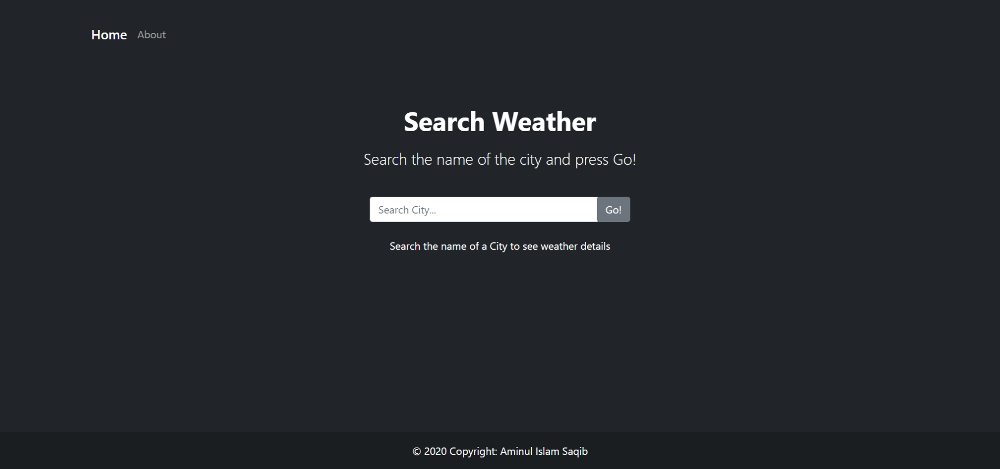
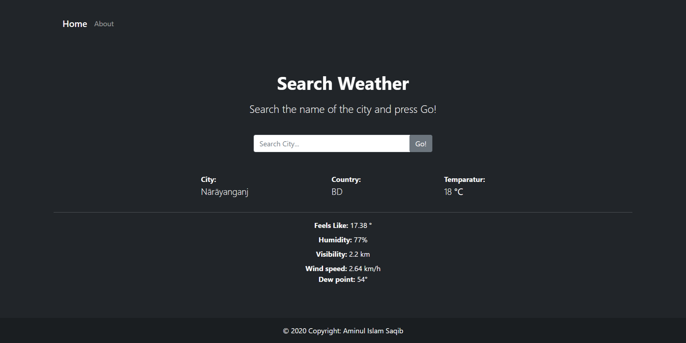
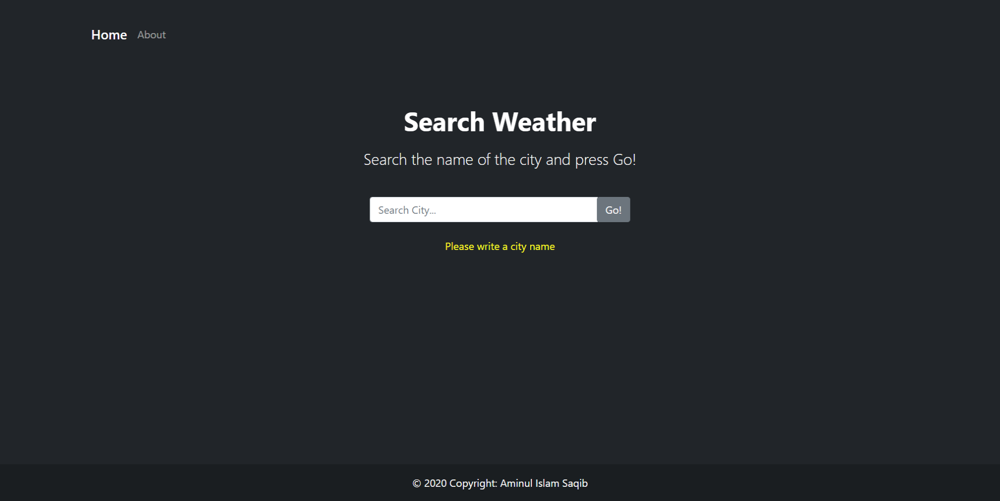

# Weather finder App

 Simple weather search with weather API in **Node Js**

personal project 

**Live Demo:** [Weather Finder](https://weatherfinderapp.herokuapp.com/ "Waether Finder")

__Snapshots__

> Front page

> Search result

> empty search validation

